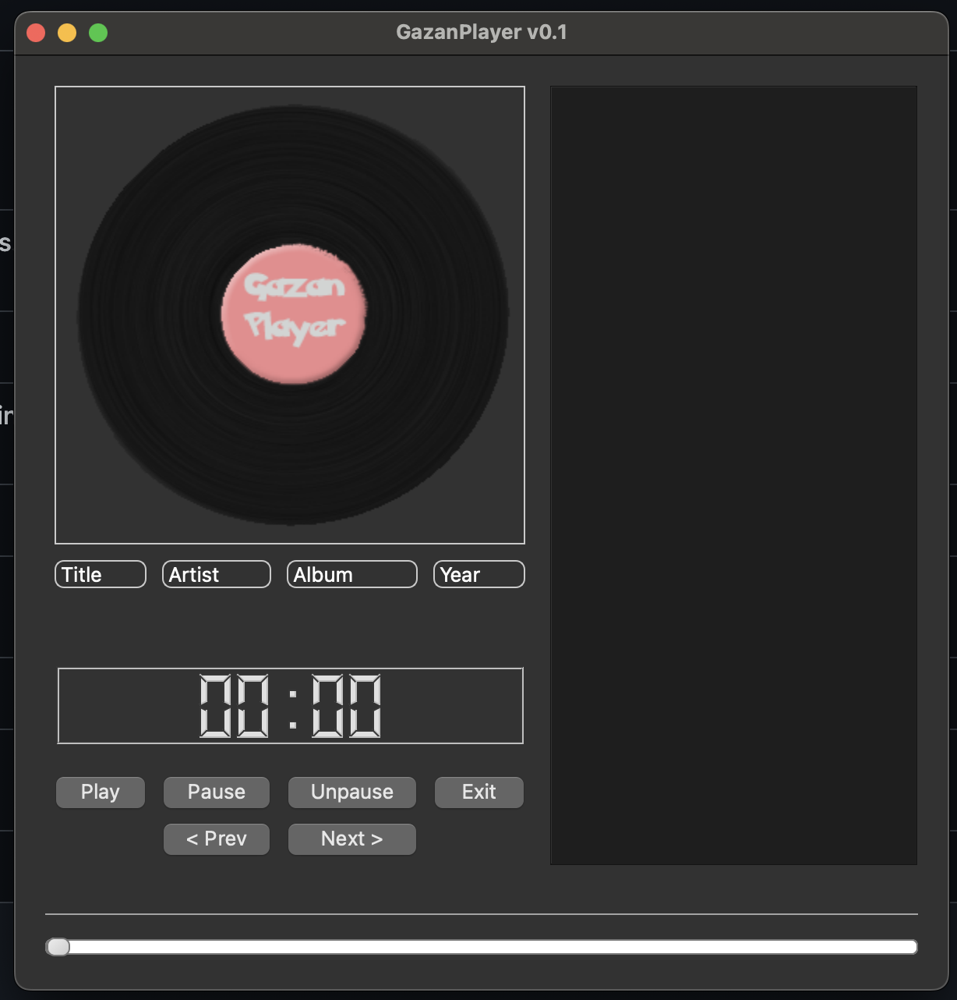
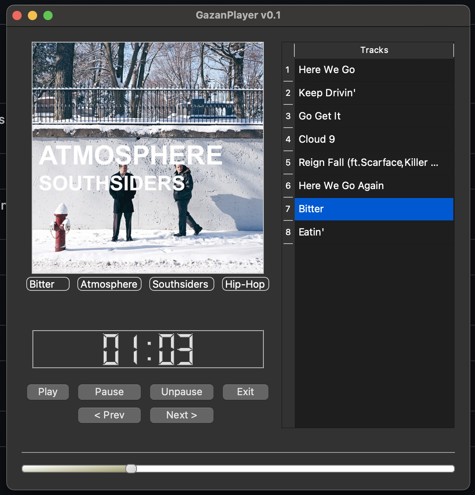

GazanPlayer
===========

A music player I built at 16 in 2014 — one of my first GUI apps. Hacked together with Python 2, PySide, and pyglet. It was rough, unpolished, and packed with teenage ambition — code that ran more on grit than grace. In 2025, I revived it on Python 3.10 and PyQt5, keeping every dirty hack and bad decision intact. This isn’t a cleanup — it’s a time capsule.

## Why a player? Why revive it?

I’ve always liked music — it’s been a constant, from tinkering in my room to now. One of the first things I wrote was this player because I wanted something I could feel connected to, something that played music my way. The player is not perfect but it’s mine — built from "scratch", quirks and all, no polish needed. Back in 2014, this was my playground — a messy mix of audio playback, album art grabs, and a slider that barely behaved. I’d hammer away at it, watching it stumble through tracks, grinning when it didn’t crash. It was pure, unfiltered coding — no deadlines, no specs, just a kid figuring it out. Fast forward to 2025: I’m older, busier, and the spark’s harder to find. Digging this up wasn’t about making it better — it was about feeling that rush again, hearing it play like it did back then.

> [!NOTE]  
> I could’ve fixed it. Refactored the threading, optimized the SQLite art reloads, swapped list indexes for cleaner logic. But that’d erase what made it mine — those clumsy hacks *were* the point. Reviving it was about honoring that 16-year-old hustle, not rewriting it with 27-year-old hindsight. So, I ported it — minimal changes, same soul. It’s still a mess, and I wouldn’t have it any other way.

## What’s here

- **2014 Original**: Python 2, PySide, pyglet—a relic on `master`. Barely runs now, but it’s frozen as I left it.
- **2025 Port**: Python 3.10, PySide2, latest libs on `2025`. Same quirks, same behavior — runs on macOS, Linux, Windows without the old crutches.

## The dirty code I kept

This is a shitty piece of code, but I’m still proud of it — not sure why, maybe it’s just nostalgia for that raw, fearless energy. Here’s some of the mess I preserved:

- **SQLite art reloads**: Loads album art from the database every track, every time—slow, wasteful, pure 2014. Could’ve cached it; didn’t.
- **Barebones error handling**: `try/except/pass` swallowing issues — silent failures galore, just like the original.
- **Threading chaos**: Two `QThread`s banging away, no finesse — CPU naps with `time.sleep(1)`. It’s raw, it’s mine.
- **Very Bad hacky example**: Check this gem I wrote — looking back, I’ve got no clue why I did it this way:
  ```python
  title = [self.instance.player.source.info.title, "Unknown"][self.instance.player.source.info.title.startswith('Unknown')]
  author = [self.instance.player.source.info.author, "Unknown"][self.instance.player.source.info.author == '']
  album = [self.instance.player.source.info.album, "Unknown"][self.instance.player.source.info.album == '']
  genre = [self.instance.player.source.info.genre, "Unknown"][self.instance.player.source.info.genre == '']
  ```
  It’s a hacky list-index trick — unreadable, brittle, and a poster child for “what was I thinking?” Kept it anyway — it’s part of the story.

## What’s missing
Some functionality never made it, and I didn’t add it in 2025 either:
* Previous Track: No way to go back — only forward with “Next.”
* Track Selection from List: The track list shows up, but you can’t click to play. It’s play/pause or bust.

## Install & run
```bash
pip install -r requirements.txt
python GazanOOP.py </path/to/music>
```

## Screenshots




## Final note
This isn’t for production — it’s for me. A reminder of where I started, why I code, and how far I’ve come without forgetting the stumbles. If you run it, enjoy the chaos — I did.
